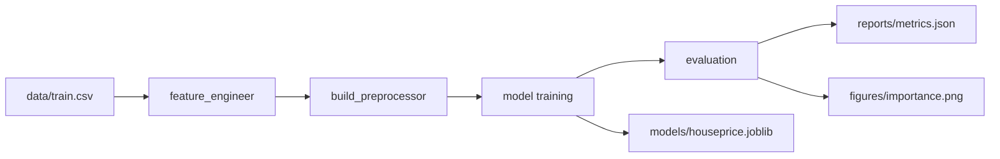

# 🏠 HousePrices ML Pipeline

<p align="center">
  
  
  
  
  
</p>

<p align="center">
  <strong>Production-ready modular ML pipeline - End-to-end workflow for regression tasks</strong><br>
  <em>Data → Feature Engineering → Preprocessing → Training → Evaluation → Reporting</em>
</p>

<p align="center">
  <a href="#-quick-start">Quick Start</a> •
  <a href="#-features">Features</a> •
  <a href="#-architecture">Architecture</a> •
  <a href="#-performance">Performance</a> •
  <a href="#-usage">Usage</a>
</p>

---

## 🚀 Quick Start

```bash
# 1. Clone repository
git clone https://github.com/4F71/HousePrices-ML-Pipeline.git
cd HousePrices-ML-Pipeline

# 2. Setup environment
python -m venv .venv
source .venv/bin/activate  # Windows: .venv\Scripts\activate
pip install -r requirements.txt

# 3. Run pipeline
python -m scripts.train_eval --model ridge
```

**That's it!** The pipeline automatically:
- Loads data and applies feature engineering
- Trains RidgeCV model with 5-fold cross-validation
- Saves model to `models/houseprice.joblib`
- Writes metrics to `reports/metrics.json`
- Generates feature importance plot at `figures/importance.png`

---

## 📊 Performance

| Metric | Score | Description |
|--------|-------|-------------|
| **R² (Local)** | **0.9394** | Model explains 93.9% of price variance |
| **RMSE (Local)** | **0.0984** | 9.8% average deviation in log-transformed prices |
| **Kaggle RMSLE** | **0.13049** | Validated score on Kaggle competition |

**Analysis:**  
The model achieves strong performance with minimal feature engineering. The validated Kaggle score of **0.13049 RMSLE** demonstrates robust generalization to unseen data (top 40% leaderboard).

<p align="center">
  
</p>

### 🏆 Kaggle Validation
This pipeline achieved **0.13049 RMSLE** on  
[Kaggle – House Prices: Advanced Regression Techniques](https://www.kaggle.com/competitions/house-prices-advanced-regression-techniques)

---

## ✨ Features

### 🧠 **Feature Engineering**
- **`TotalSF`** → Total living area (1stFlrSF + 2ndFlrSF + TotalBsmtSF)
- **`BathCount`** → Total bathrooms (FullBath + 0.5×HalfBath)
- **`Age`** → House age (2020 - YearBuilt)
- **Log transformation** → Applied to `GrLivArea`, `TotalSF`, `SalePrice`
- **Outlier filtering** → Removes extreme `GrLivArea` values

### ⚙️ **Preprocessing Pipeline**
- **Numeric features:**
  - Missing values → SimpleImputer (mean strategy)
  - Scaling → StandardScaler
- **Categorical features:**
  - Missing values → SimpleImputer (most frequent strategy)
  - Encoding → OneHotEncoder (handles unknown categories)

### 🤖 **Model Selection**
4 regression models with cross-validation support:

```bash
python -m scripts.train_eval --model linear    # LinearRegression
python -m scripts.train_eval --model ridge     # RidgeCV (L2, default)
python -m scripts.train_eval --model lasso     # LassoCV (L1)
python -m scripts.train_eval --model elastic   # ElasticNetCV (L1+L2)
```

**Default (RidgeCV):**
- Alpha values: [0.1, 1.0, 10.0]
- Cross-validation: 5-fold
- L2 regularization prevents overfitting

### 📈 **Automated Reporting**
- **JSON metrics:** `reports/metrics.json`
- **Feature importance:** `figures/importance.png`
- **Model persistence:** `models/houseprice.joblib`

---

## 🗂️ Architecture

```
HousePrices/
│
├── data/                    # Raw datasets
│   ├── train.csv
│   └── test.csv
│
├── models/                  # Trained models
│   └── houseprice.joblib
│
├── reports/                 # Performance metrics
│   └── metrics.json
│
├── figures/                 # Visualizations
│   └── importance.png
│
├── src/                     # Core modules
│   ├── paths.py            # Project path management
│   ├── data.py             # Data loading utilities
│   ├── features.py         # Feature engineering
│   ├── preprocess.py       # Preprocessing pipeline
│   ├── model.py            # Model factory
│   ├── pipeline.py         # Pipeline builder
│   ├── train.py            # Training logic
│   ├── eval.py             # Evaluation metrics
│   └── visualize.py        # Feature importance plots
│
├── scripts/
│   └── train_eval.py       # End-to-end execution script
│
├── requirements.txt         # Python dependencies
├── .gitignore
└── README.md
```

---

## 🔄 Pipeline Flow



**Step-by-step:**
1. **Data loading** → `src/data.py`
2. **Feature engineering** → `src/features.py`
3. **Preprocessor creation** → `src/preprocess.py` (numeric + categorical transformers)
4. **Pipeline creation** → `src/pipeline.py` (preprocessor + model)
5. **Training & saving** → `src/train.py` (80/20 split, random_state=42)
6. **Evaluation** → `src/eval.py` (R², RMSE)
7. **Visualization** → `src/visualize.py` (top 15 features)

---

## 📖 Usage

### Basic Training
```bash
python -m scripts.train_eval --model ridge
```

### Modular Usage
```python
# Data loading and feature engineering
from src.data import load_data
from src.features import feature_engineer

df = load_data("train.csv")
df = feature_engineer(df)

# Preprocessor creation
from src.preprocess import build_preprocessor

numeric = df.select_dtypes(include=["int32", "int64", "float32", "float64"]).columns.tolist()
categorical = df.select_dtypes(include=["object"]).columns.tolist()
numeric.remove("SalePrice")

preprocessor = build_preprocessor(numeric, categorical)

# Model training
from src.model import get_model
from src.train import train_and_save

model = get_model("ridge")
train_and_save(df, preprocessor, model)
```

### Generate Feature Importance Plot
```bash
python src/visualize.py
```

### Load Saved Model
```python
import joblib

model = joblib.load("models/houseprice.joblib")
predictions = model.predict(X_test)
```

---

## 🛠️ Tech Stack

| Category | Technology |
|----------|-----------|
| **Language** | Python 3.10+ |
| **ML Framework** | scikit-learn 1.7.2 |
| **Data Processing** | pandas 2.3.3, numpy 2.2.6 |
| **Visualization** | matplotlib 3.10.7, seaborn 0.13.2 |
| **Serialization** | joblib 1.5.2 |
| **Notebook** | JupyterLab 4.4.10 (optional) |

---

## 📂 Dataset

This project uses the **Kaggle House Prices: Advanced Regression Techniques** dataset.

🔗 [Download Dataset](https://www.kaggle.com/c/house-prices-advanced-regression-techniques/data)

**Structure:**
- `train.csv` → 1460 samples, 81 features
- `test.csv` → 1459 samples (for submission)

Place both files in the `data/` directory before running the pipeline.

---

## 🎯 Design Principles

✅ **Modularity** → Each component has a single responsibility  
✅ **Reproducibility** → Fixed random seeds, version-locked dependencies  
✅ **PEP 257 Compliance** → Docstrings for all public functions  
✅ **Production-Ready** → Clean separation of concerns, no hardcoded paths  
✅ **Extensibility** → Easy to add new models or feature engineering steps

---

## 🤝 Contributing

This is a portfolio project demonstrating ML engineering best practices. You can:
- Fork and experiment
- Suggest improvements via issues
- Use as a template for your own projects

---

## 📜 License

**MIT License** © 2025 Onur Tilki

Permission is hereby granted, free of charge, to any person obtaining a copy of this software and associated documentation files (the "Software"), to deal in the Software without restriction, including without limitation the rights to use, copy, modify, merge, publish, distribute, sublicense, and/or sell copies of the Software.

**THE SOFTWARE IS PROVIDED "AS IS", WITHOUT WARRANTY OF ANY KIND.**

---

## 👨‍💻 Author

**Onur Tilki**

- 🌐 GitHub: [@4F71](https://github.com/4F71)
- 📊 Kaggle: [@onurtilki](https://www.kaggle.com/onurtilki)
- 💼 LinkedIn: [onurtilki](https://www.linkedin.com/in/onurtilki/)

---

## 🙏 Acknowledgments

- Dataset: [Kaggle House Prices Competition](https://www.kaggle.com/c/house-prices-advanced-regression-techniques)
- Inspiration: Production-level ML systems and software engineering best practices

---

<p align="center">
  <strong>⭐ If you find this useful, please consider starring the repository!</strong>
</p>

