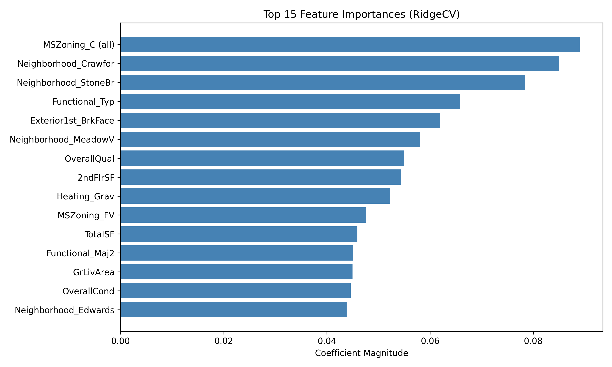
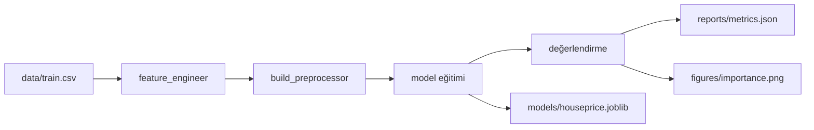

# 🏠 HousePrices ML Pipeline

<p align="center">
  
  
  
  
  
</p>

<p align="center">
  <strong>Üretim seviyesinde, modüler makine öğrenimi pipeline'ı - Kaggle House Prices regresyon projesi</strong><br>
  <em>Uçtan uca iş akışı: Veri → Feature Engineering → Ön İşleme → Model → Değerlendirme → Rapor</em>
</p>

<p align="center">
  <a href="#-hızlı-başlangıç">Hızlı Başlangıç</a> •
  <a href="#-özellikler">Özellikler</a> •
  <a href="#-pipeline-mimarisi">Mimari</a> •
  <a href="#-model-performansı">Performans</a> •
  <a href="#-kullanım">Kullanım</a>
</p>

---

## 🚀 Hızlı Başlangıç

```bash
# 1. Repository'yi klonla
git clone https://github.com/4F71/HousePrices-ML-Pipeline.git
cd HousePrices-ML-Pipeline

# 2. Sanal ortamı kur
python -m venv .venv
source .venv/bin/activate  # Windows: .venv\Scripts\activate
pip install -r requirements.txt

# 3. Pipeline'ı çalıştır
python -m scripts.train_eval --model ridge
```

**Bu kadar!** Pipeline otomatik olarak:
- Veriyi yükler ve feature engineering uygular
- 5-fold cross-validation ile RidgeCV modelini eğitir
- Modeli `models/houseprice.joblib` olarak kaydeder
- Metrikleri `reports/metrics.json` dosyasına yazar
- Feature importance grafiğini `figures/importance.png` olarak oluşturur

---

| Metrik | Skor | Açıklama |
|--------|-------|-----------|
| **R² (Local)** | **0.9394** | Model, fiyatlardaki varyansın %93.9’unu açıklıyor |
| **RMSE (Local)** | **0.0984** | Log-dönüşümlü hatada %9.8 ortalama sapma |
| **RMSLE (Kaggle)** | **0.13049** | Gerçek fiyat ölçeğinde Kaggle doğrulama skoru |

**Yorum:**  
Model, veri setindeki varyansın büyük kısmını açıklamakta ve log dönüşümü sonrası düşük hata oranı elde etmektedir.  
Kaggle ortamında doğrulanan **0.13049 RMSLE** değeri, bu pipeline’ın **Level-1 baseline** seviyesinde güçlü bir genel performans sunduğunu gösterir.

<p align="center">
  
</p>

---

### 📈 Kaggle Baseline Result
This pipeline achieved **0.13049 RMSLE** on  
[Kaggle – House Prices: Advanced Regression Techniques](https://www.kaggle.com/competitions/house-prices-advanced-regression-techniques)

---

## ✨ Özellikler

### 🧠 **Feature Engineering**
- **`TotalSF`** → Toplam yaşam alanı (1stFlrSF + 2ndFlrSF + TotalBsmtSF)
- **`BathCount`** → Toplam banyo sayısı (FullBath + 0.5×HalfBath)
- **`Age`** → Ev yaşı (2020 - YearBuilt)
- **Log dönüşümü** → `GrLivArea`, `TotalSF`, `SalePrice` sütunlarına uygulandı
- **Outlier filtreleme** → Aşırı `GrLivArea` değerlerini kaldırır

### ⚙️ **Ön İşleme Pipeline**
- **Sayısal özellikler:**
  - Eksik değerler → SimpleImputer (ortalama stratejisi)
  - Ölçekleme → StandardScaler
- **Kategorik özellikler:**
  - Eksik değerler → SimpleImputer (en sık görülen değer stratejisi)
  - Kodlama → OneHotEncoder (bilinmeyen kategorileri yönetir)

### 🤖 **Model Seçimi**
Cross-validation destekli 4 farklı regresyon modeli:

```bash
python -m scripts.train_eval --model linear    # LinearRegression
python -m scripts.train_eval --model ridge     # RidgeCV (L2, varsayılan)
python -m scripts.train_eval --model lasso     # LassoCV (L1)
python -m scripts.train_eval --model elastic   # ElasticNetCV (L1+L2)
```

**Varsayılan (RidgeCV):**
- Alpha değerleri: [0.1, 1.0, 10.0]
- Cross-validation: 5-fold
- L2 regularization ile aşırı öğrenmeyi önler

### 📈 **Otomatik Raporlama**
- **JSON metrikleri:** `reports/metrics.json`
- **Feature importance:** `figures/importance.png`
- **Model kaydı:** `models/houseprice.joblib`

---

## 🏗️ Pipeline Mimarisi

```
HousePrices/
│
├── data/                    # Ham veri setleri
│   ├── train.csv
│   └── test.csv
│
├── models/                  # Eğitilmiş modeller
│   └── houseprice.joblib
│
├── reports/                 # Performans metrikleri
│   └── metrics.json
│
├── figures/                 # Görselleştirmeler
│   └── importance.png
│
├── src/                     # Çekirdek modüller
│   ├── paths.py            # Proje yolu yönetimi
│   ├── data.py             # Veri yükleme araçları
│   ├── features.py         # Feature engineering
│   ├── preprocess.py       # Ön işleme pipeline'ı
│   ├── model.py            # Model fabrikası
│   ├── pipeline.py         # Pipeline oluşturucu
│   ├── train.py            # Eğitim mantığı
│   ├── eval.py             # Değerlendirme metrikleri
│   └── visualize.py        # Feature importance grafiği
│
├── scripts/
│   └── train_eval.py       # Uçtan uca çalıştırma scripti
│
├── requirements.txt         # Python bağımlılıkları
├── .gitignore
└── README.md
```

---

## 🔄 Pipeline Akışı



**Adım adım:**
1. **Veri yükleme** → `src/data.py`
2. **Feature engineering** → `src/features.py`
3. **Preprocessor oluşturma** → `src/preprocess.py` (sayısal + kategorik dönüştürücüler)
4. **Pipeline oluşturma** → `src/pipeline.py` (preprocessor + model)
5. **Eğitim & kayıt** → `src/train.py` (80/20 bölme, random_state=42)
6. **Değerlendirme** → `src/eval.py` (R², RMSE)
7. **Görselleştirme** → `src/visualize.py` (en önemli 15 özellik)

---

## 📖 Kullanım

### Temel Eğitim
```bash
python -m scripts.train_eval --model ridge
```

### Modüler Kullanım
```python
# Veri yükleme ve feature engineering
from src.data import load_data
from src.features import feature_engineer

df = load_data("train.csv")
df = feature_engineer(df)

# Preprocessor oluşturma
from src.preprocess import build_preprocessor

numeric = df.select_dtypes(include=["int32", "int64", "float32", "float64"]).columns.tolist()
categorical = df.select_dtypes(include=["object"]).columns.tolist()
numeric.remove("SalePrice")

preprocessor = build_preprocessor(numeric, categorical)

# Model eğitimi
from src.model import get_model
from src.train import train_and_save

model = get_model("ridge")
train_and_save(df, preprocessor, model)
```

### Feature Importance Grafiği Oluşturma
```bash
python src/visualize.py
```

### Kayıtlı Modeli Yükleme
```python
import joblib

model = joblib.load("models/houseprice.joblib")
tahminler = model.predict(X_test)
```

---

## 🛠️ Teknoloji Yığını

| Kategori | Teknoloji |
|----------|-----------|
| **Dil** | Python 3.10+ |
| **ML Framework** | scikit-learn 1.7.2 |
| **Veri İşleme** | pandas 2.3.3, numpy 2.2.6 |
| **Görselleştirme** | matplotlib 3.10.7, seaborn 0.13.2 |
| **Serileştirme** | joblib 1.5.2 |
| **Notebook** | JupyterLab 4.4.10 (opsiyonel) |

---

## 📂 Veri Seti

Bu proje **Kaggle House Prices: Advanced Regression Techniques** veri setini kullanmaktadır.

🔗 [Veri Setini İndir](https://www.kaggle.com/c/house-prices-advanced-regression-techniques/data)

**Yapı:**
- `train.csv` → 1460 örnek, 81 özellik
- `test.csv` → 1459 örnek (submission için)

Her iki dosyayı da pipeline'ı çalıştırmadan önce `data/` dizinine yerleştirin.

---

## 🔍 Extra EDA Notes
- Minor refactor & docs update.

---
## 🎯 Tasarım İlkeleri

✅ **Modülerlik** → Her bileşenin tek bir sorumluluğu var  
✅ **Tekrarlanabilirlik** → Sabit random seed'ler, versiyon kilitli bağımlılıklar  
✅ **PEP 257 Uyumluluğu** → Tüm public fonksiyonlarda docstring  
✅ **Üretime Hazır** → Temiz sorumluluk ayrımı, hardcoded path yok  
✅ **Genişletilebilirlik** → Yeni model veya feature engineering adımları eklemek kolay

---

## 🤝 Katkıda Bulunma

Bu, ML mühendisliği en iyi uygulamalarını gösteren bir portföy projesidir. Yapabilecekleriniz:
- Fork edip deneyebilirsiniz
- Issue'lar aracılığıyla iyileştirme önerebilirsiniz
- Kendi projeleriniz için şablon olarak kullanabilirsiniz

---

## 📜 Lisans

**MIT Lisansı** © 2025 Onur Tilki

Bu yazılımın ve ilgili dokümantasyon dosyalarının ("Yazılım") bir kopyasını edinen herhangi bir kişiye, Yazılımı kısıtlama olmaksızın kullanma, kopyalama, değiştirme, birleştirme, yayınlama, dağıtma, alt lisans verme ve/veya satma hakları dahil olmak üzere Yazılımı kullanma izni ücretsiz olarak verilir.

**YAZILIM "OLDUĞU GİBİ" SAĞLANIR, HİÇBİR GARANTİ VERİLMEZ.**

---


## 👨‍💻 Yazar

**Onur Tilki** 

- 🌐 GitHub: [@4F71](https://github.com/4F71)
- 📊 Kaggle: [@onurtilki](https://www.kaggle.com/onurtilki)

---

## 🙏 Teşekkürler

- Veri Seti: [Kaggle House Prices Competition](https://www.kaggle.com/c/house-prices-advanced-regression-techniques)
- İlham Kaynağı: Üretim seviyesi ML sistemleri ve yazılım mühendisliği en iyi uygulamaları

---

---
🏆 **Version:** ElasticNetCV v1.0  
📊 **Kaggle RMSLE:** 0.13049  
🧩 **Status:** Baseline model successfully validated on Kaggle (2025)


<p align="center">
  <strong>⭐ Faydalı bulduysanız yıldız vermeyi düşünün!</strong>
</p>

<p align="center">
  ❤️ ve scikit-learn ile yapıldı
</p>
